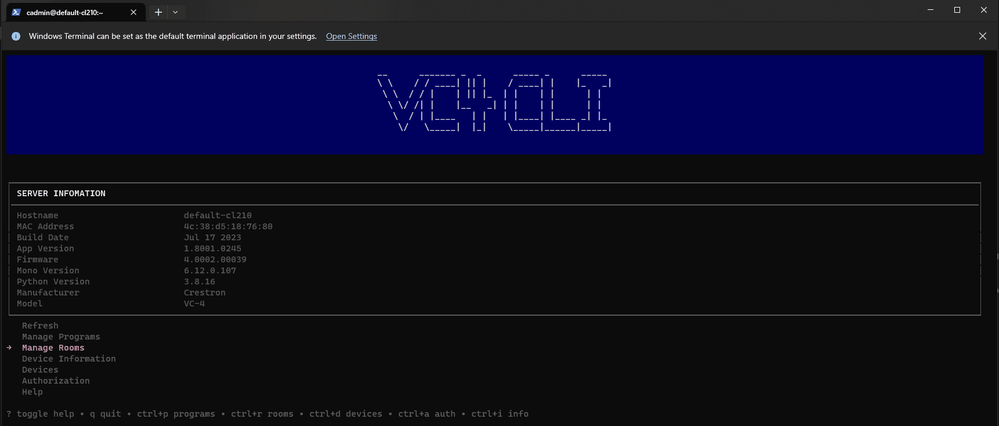

[](https://goreportcard.com/report/github.com/ewilliams0305/vcli)
 
 
```go
__      _______ _  _      _____ _      _____ 
\ \    / / ____| || |    / ____| |    |_   _|
 \ \  / / |    | || |_  | |    | |      | |  
  \ \/ /| |    |__   _| | |    | |      | |  
   \  / | |____   | |   | |____| |____ _| |_ 
    \/   \_____|  |_|    \_____|______|_____|
```


# 🆑 vcli
Ever found yourself connected to a VC4 appliance troublshooting the OS, working on the file system,
or restarting services, only to find you can't perform actions on the actual VC4 service? Well now you can. 
The VC4 CLI provides full control over the VC4 service from within the linux terminal allowing operators to:


Command line interface to operate a Crestron Virtual Control server application from the Linux Shell
The VC4 CLI leverages the Crestron Virtual control REST API with a loopback IP address 
to provide a localized CLI for the VC4 service. This CLI 
uses the `BubbleTea` TUI framework for navigation and command line workflows. 

# 👷‍♂️ Building 
To compile the cli for your VC4 appliance you will need to install
the GO sdk. Download the SDK at https://go.dev/dl/ Once download you can build the ~/. root repository directory as an executable. 

## 🪟 Windows
To build on windows for windows simply navigate to the repostiry root director and issue `go build ./...` to compile an EXE including all child modules.  See the go sdk documentation for more details and optional compiler flags.

## 🐧 Linux
To build the CLI from a windows computer for the VC4 appliance, you can use the go cross compiler.  Ensure the go compiler is installed on your machine and open a PowerShell terminal session.


Change your directory to the repository root directory

`cd ./`

Set the GOOS and GOARCH environment variables to 

 `vcli> $env:GOOS = "linux"`

 `vcli> $env:GOARCH = "amd64"`

Run the GO BUILD command to create a new executable in the bin directory that will run on your VC4 appliance. 
The flags used will optimize the compilation and output the linux amd64 binary to the ./bin directory in the repository. 

`vcli> go build -tags netgo -installsuffix netgo -ldflags="-w -s" -o bin/ .\...`

Once compiled you should have a file titled with the name of your repositories root directory with no file extension (remeber linux...).

Copy this file to your VC4 appliance and execute `chmod +x ./vcli` to allow execution.  Finally run the application `./vcli`.  Of course you can name this file anything you like and add addtional flags to the go build command.

 *Of course you could just install make and type `make all`*

# 🚀 Launching
Once compiled you can launch the application by executing the binary. 
The application supports serveral command line argument flags

`-host` or short `-h`

`-token` or short `t`

If no host flag is provided the application is assumed to be executing on the VC4 appliance and localhost will be used. 
for local host operation NO TOKEN IS REQUIRED, yes, no token. This means the cli can be instantly used without every logging into
the VC4 webpage. 

When the application is started with a host and token flag the cli will target a remote server. I've also 
this from one VC4 to another VC4. Lauch the app with flags;

`./vcli -h 10.0.0.111 -t "TOKEN_HERE"`

If the VC4 service is running you will instantly see the device information table loaded with data. 

# 🦮 Guides
Tutorials for the `vcli` providing use cases and examples 

## 🚻 Controlling Rooms

### Start and stop rooms
As of v0.0.1 users can start, stop, enable/disable debugging, and restart rooms.  CRUD operrations to create new rooms will be added at a later time. 


### Add and remove rooms

## 🧑‍💻 Programs

## ⚖️ Authorization and Licenses

## 📲 Device mapping and status

## ℹ️ System information 

# 🕸️ Crestron REST API Reference 
https://www.crestron.com/getmedia/29921c49-86df-488c-a63b-ab88620d7175/mg_pg_rest-api-crestron-virtual-control


